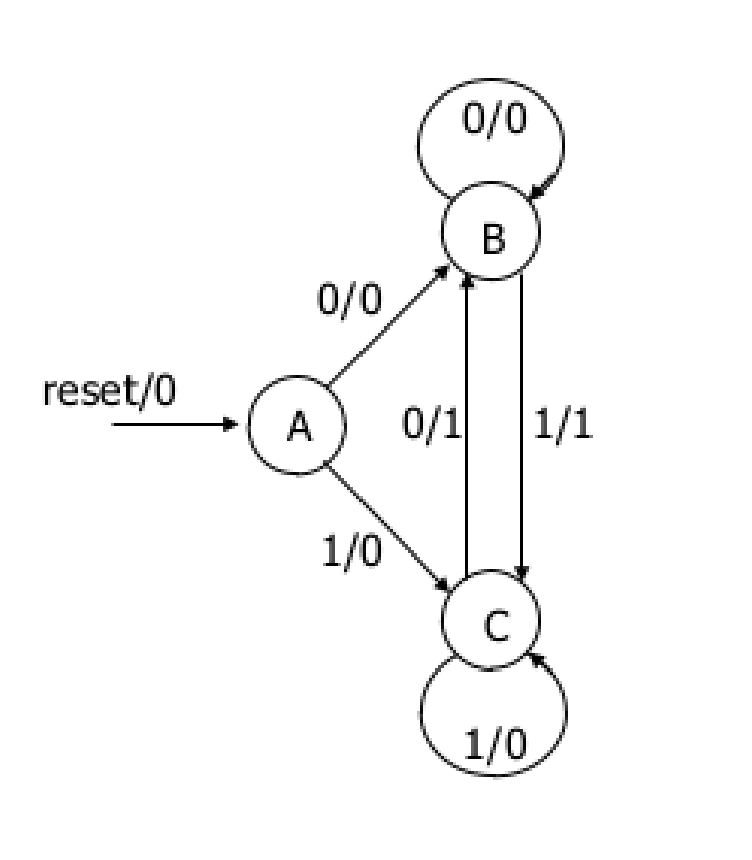

## To run verilog file:
```
$ iverilog mysim file1.v file2.v
$ vvp mysim
```

# Assignment-1

Q1) Write a verilog code to define the following FSM. Testbench should test all states and combinations
For eg- 0/0 in the FSM means, input = 0 in that state and output=0



### Answer
* [FSM MODULE](q1_fsm_module.v)


* [TESTBENCH MODULE](q2_testbench_module.v)

Q2) Two verilog files (q0_counter.v, q1_alu.v) – counter and ALU, with errors,have been uploaded. You are required to debug
the errors, and fix them

### Answer

* [q0_counter](q2_q0.v)
* [q1_alu](q2_q1.v)

 
